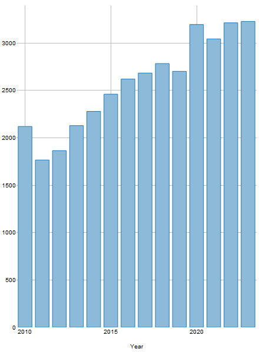
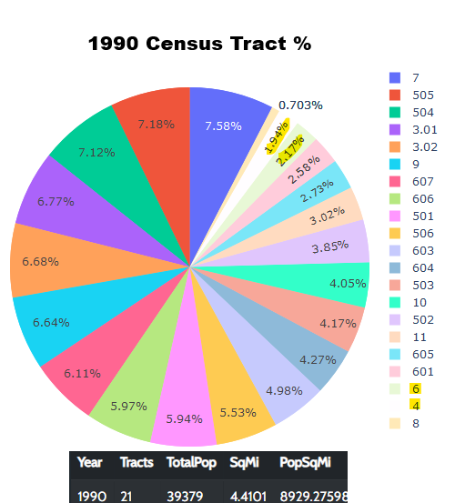
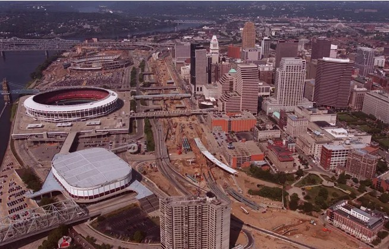
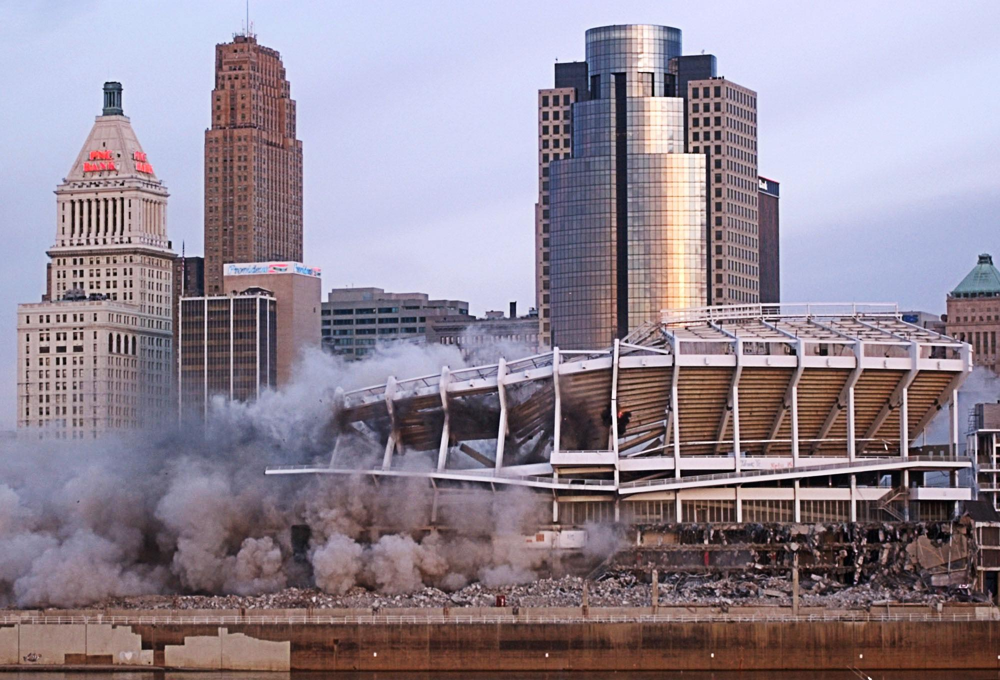
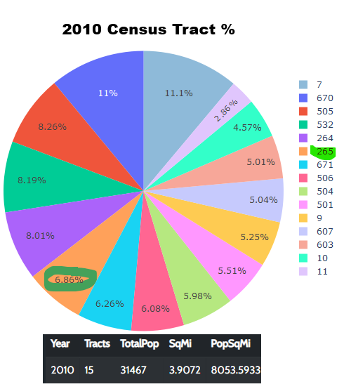
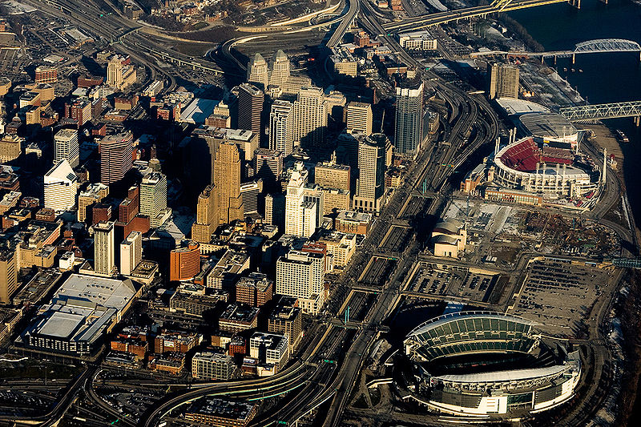
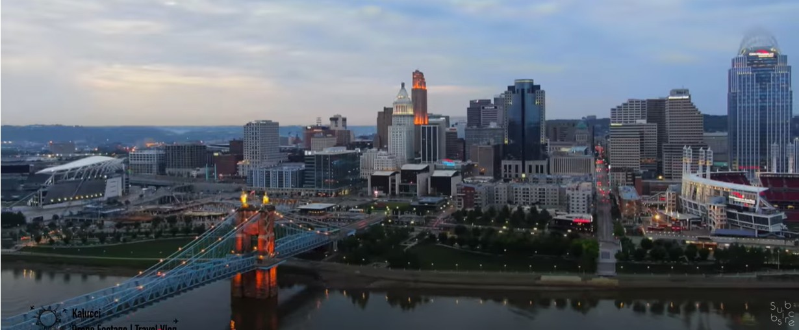
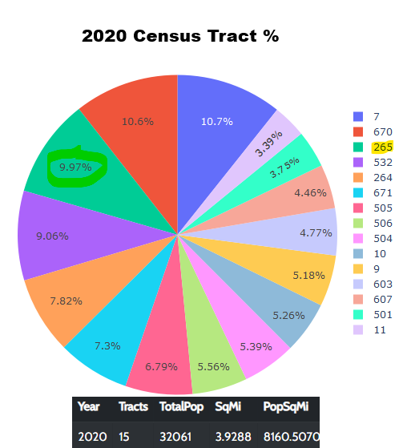
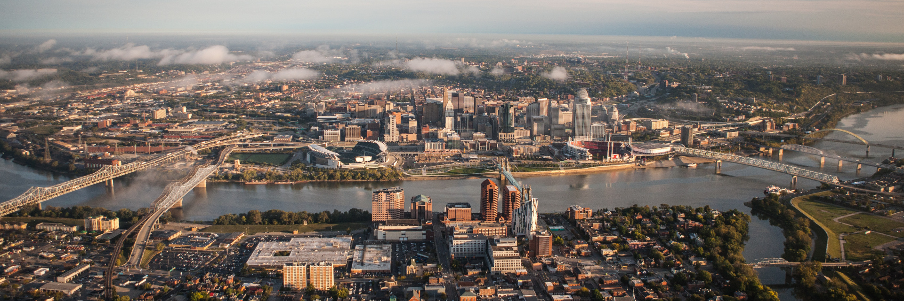

# map698-proposal
Charles Altendorf's proposal for spring 2025 proposal

# Project Overview  

<!--Markdown formatting for this section was generated with the help of chatgpt on 3/7/2025-->

Cincinnati’s riverfront has undergone a dramatic transformation over the past few decades, reversing a long period of population decline. This project examines how strategic revitalization efforts—particularly in **Census Tract 265**—played a crucial role in this resurgence. By analyzing demographic trends, redevelopment projects, and urban planning initiatives, this study demonstrates how targeted investments have reshaped the city’s core.  

This research is deeply personal to me. As a **2007 graduate of Boone County High School**, an **11-year member of the Germania Society of Cincinnati**, and a **three-time student of undergraduate urban geography courses**, I have closely followed the changes in the region. Additionally, the perspectives included in this study come from interviews with locals I’ve known over time, providing an authentic view of the transformation.  

## The Growth of Census Tract 265  

Between **2010 and 2020**, Census Tract 265 experienced **remarkable growth**, gaining nearly **1,000 residents**. This boom was fueled by:  

- **6** new and renovated apartment buildings  
- **3** condominium complexes  
- **25** restaurants and bars  
- A **major convention center renovation** set to open in 2025  

  

Historically, the area struggled. In **1990**, Census Tracts **4 and 6**—which later merged into Tract 265—accounted for just **4% of the total 39,379 people** living in Cincinnati’s central riverfront area (including Covington and Newport).  

  

By **2000**, this figure had only risen slightly to **5%**, even as the total population declined to **33,283**. Cincinnati’s leaders recognized the urgent need for change, a sentiment reflected in **Petitt’s work** (to be discussed in the literature review).  

## Key Redevelopment Efforts  

The revitalization of Tract 265 was driven by **two major urban planning initiatives**:  

### 1. Reconstructing Fort Washington Way  
This project reduced the highway’s surface footprint, creating a more seamless connection between downtown and the riverfront.  

  

### 2. Demolishing Riverfront Stadium  
The removal of the stadium opened space for mixed-use developments and improved pedestrian access, particularly for those crossing the **Roebling Suspension Bridge** into Ohio.  

  

By **2010**, Census Tract 265 had grown significantly, now accounting for **6.86% of the total 31,467 residents** in the riverfront area. Aerial images from that time clearly illustrate the **reclaimed urban space**, with the Roebling Bridge now leading into a far more open and accessible downtown core.  

  
  

As redevelopment continued into **2015**, parking lots were further replaced with **green spaces, apartments, hotels, and entertainment venues**, reinforcing the city’s commitment to mixed-use urban renewal.  

## A Vibrant Riverfront by 2025  

By **2020**, despite the onset of COVID-19, the Cincinnati riverfront had cemented itself as a vibrant hub of activity. Aerial views showcase an inviting, walkable space **directly accessible from the Roebling Bridge**.  

  

Census data reflects this momentum, with the total riverfront population rising to **32,061**, and Census Tract 265 now comprising **9.97% of the area’s residents**—a nearly **10% share** compared to just 4% in 1990.  

  

By **2025**, the area is more bustling than ever.  

  

## Why This Project Matters  

While previous studies—such as Petitt’s—have examined Cincinnati’s revitalization, this project takes the analysis a step further. By leveraging **interactive digital mapping**, this research aims to create an **immersive experience**, allowing users to explore building changes over time dynamically. This approach will provide a **more engaging and intuitive** way to understand how targeted redevelopment has reshaped the riverfront.  

This project is not just about numbers or buildings—it’s about the **reclamation of urban space** and the **people who now call this revitalized area home**. Through this study, I hope to highlight **how cities can successfully reverse decline** and create **thriving, livable environments for future generations**.  
