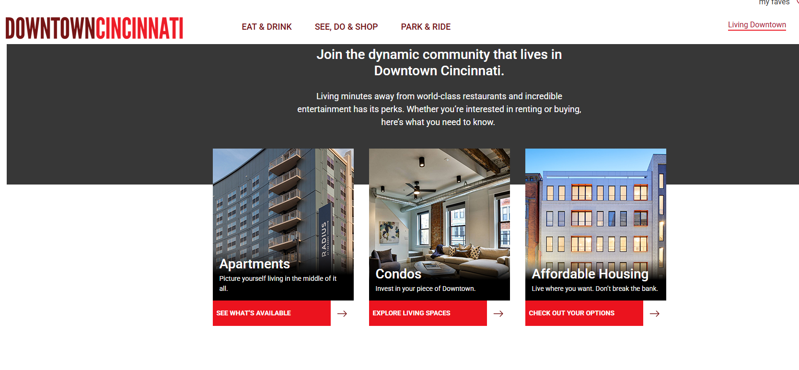
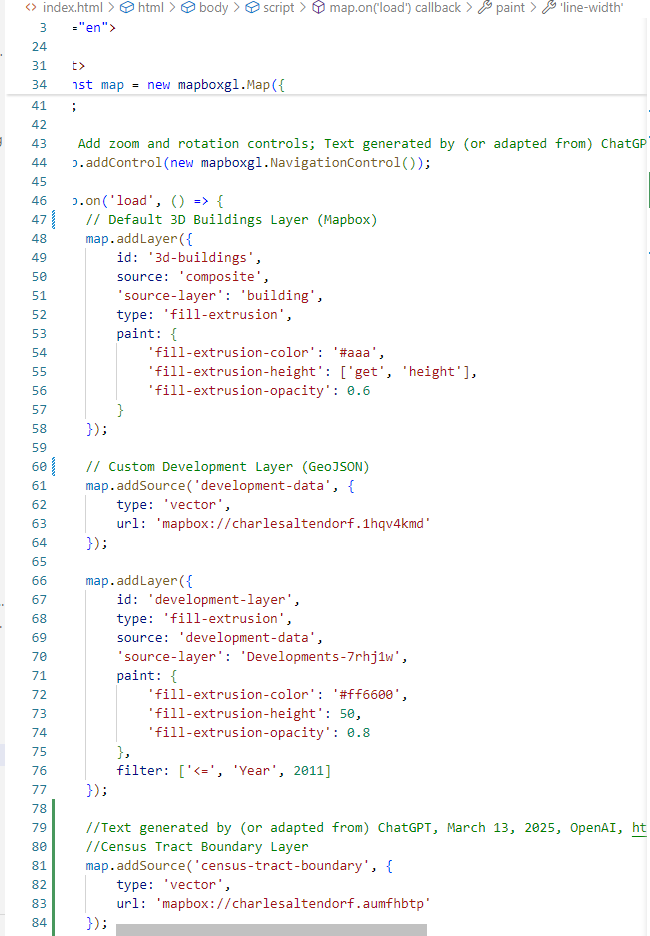
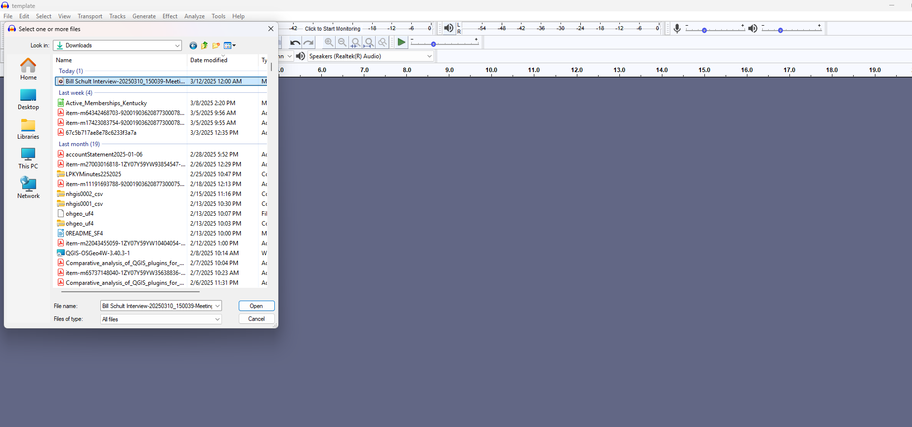
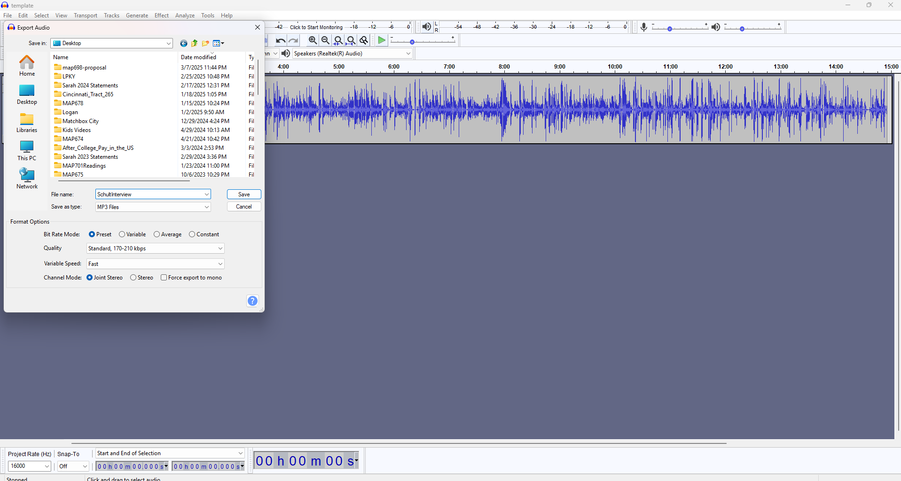
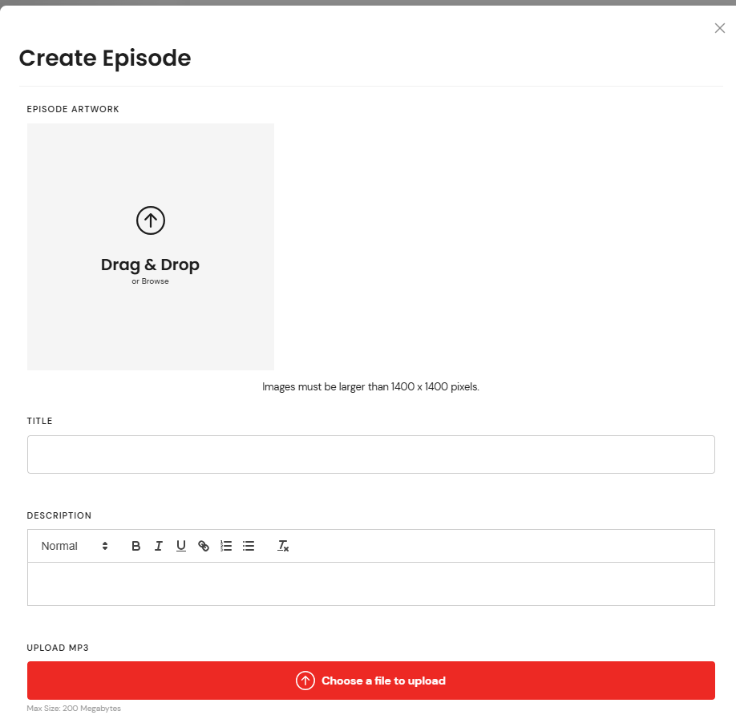

# map698-proposal
Charles Altendorf's proposal for spring 2025 proposal

# Project Overview  

<!--Format generated by (or adapted from) ChatGPT, March 7, 2025, OpenAI, https://chat.openai.com-->

Cincinnati’s riverfront has undergone a dramatic transformation over the past few decades, reversing a long period of population decline. This project examines how strategic revitalization efforts—particularly in **Census Tract 265**—played a crucial role in this resurgence. By analyzing demographic trends, redevelopment projects, and urban planning initiatives, this study demonstrates how targeted investments have reshaped the city’s core.  

This research is deeply personal to me. As a **2007 graduate of Boone County High School**, an **11-year member of the Germania Society of Cincinnati**, and a **three-time student of undergraduate urban geography courses**, I have closely followed the changes in the region. Additionally, the perspectives included in this study come from interviews with locals I’ve known over time, providing an authentic view of the transformation.  

## The Growth of Census Tract 265  

Between **2010 and 2020**, Census Tract 265 experienced **remarkable growth**, gaining nearly **1,000 residents**. This boom was fueled by:  

- **6** new and renovated apartment buildings  
- **3** condominium complexes  
- **25** restaurants and bars  
- A **major convention center renovation** set to open in 2025  

  

Historically, the area struggled. In **1990**, Census Tracts **4 and 6**—which later merged into Tract 265—accounted for just **4% of the total 39,379 people** living in Cincinnati’s central riverfront area (including Covington and Newport).  

  

By **2000**, this figure had only risen slightly to **5%**, even as the total population declined to **33,283**. Cincinnati’s leaders recognized the urgent need for change, a sentiment reflected in **Petitt’s work** (to be discussed in the literature review).  

## Key Redevelopment Efforts  

The revitalization of Tract 265 was driven by **two major urban planning initiatives**:  

### 1. Reconstructing Fort Washington Way  
This project reduced the highway’s surface footprint, creating a more seamless connection between downtown and the riverfront.  

  

### 2. Demolishing Riverfront Stadium  
The removal of the stadium opened space for mixed-use developments and improved pedestrian access, particularly for those crossing the **Roebling Suspension Bridge** into Ohio.  

  

By **2010**, Census Tract 265 had grown significantly, now accounting for **6.86% of the total 31,467 residents** in the riverfront area. Aerial images from that time clearly illustrate the **reclaimed urban space**, with the Roebling Bridge now leading into a far more open and accessible downtown core.  

  
  

As redevelopment continued into **2015**, parking lots were further replaced with **green spaces, apartments, hotels, and entertainment venues**, reinforcing the city’s commitment to mixed-use urban renewal.  

## A Vibrant Riverfront by 2025  

By **2020**, despite the onset of COVID-19, the Cincinnati riverfront had cemented itself as a vibrant hub of activity. Aerial views showcase an inviting, walkable space **directly accessible from the Roebling Bridge**.  

  

Census data reflects this momentum, with the total riverfront population rising to **32,061**, and Census Tract 265 now comprising **9.97% of the area’s residents**—a nearly **10% share** compared to just 4% in 1990.  

  

By **2025**, the area is more bustling than ever.  

  

## Why This Project Matters  

While previous studies—such as Petitt’s—have examined Cincinnati’s revitalization, this project takes the analysis a step further. By leveraging **interactive digital mapping**, this research aims to create an **immersive experience**, allowing users to explore building changes over time dynamically. This approach will provide a **more engaging and intuitive** way to understand how targeted redevelopment has reshaped the riverfront.  

This project is not just about numbers or buildings—it’s about the **reclamation of urban space** and the **people who now call this revitalized area home**. Through this study, I hope to highlight **how cities can successfully reverse decline** and create **thriving, livable environments for future generations**.  

# Literature Review

## Professional Articles
**Duran, et al (2021)** examined seven Spanish urban river environments, analyzing how public spaces, commercial activities, and industrial uses interact with the riverfront. The authors develop a classification model to assess the effectiveness of these interactions, considering factors such as accessibility, ecological impact, and economic activity. The research is particularly relevant as some of the cities studied are similar in size to Cincinnati, providing valuable insights into the evolving relationship between urban spaces, industry, and riverfront development.

**Pinto, et al (2020)** analyzed riverfront projects in Tbilisi, Ipswich, London, Ponte de Sor, and Houston, highlighting common pitfalls in riverfront development. The authors identify five main reasons projects fail: poor location, inadequate budget, mismatched programming, bad timing, and inappropriate design choices. This framework provides a useful lens for evaluating Cincinnati’s riverfront growth, which has largely succeeded by selecting the right location, programming, and timing. Applying these criteria could also help assess remaining challenges or areas for further improvement in Cincinnati’s riverfront development.

**Hussein (2006)** explores the historical development of urban riverfronts, tracing their evolution from ancient times to modern examples in cities like Singapore, Sarawak, Boston, and London. It emphasizes the key elements that have contributed to making these riverfronts central to their cities. This is particularly relevant for Cincinnati, as I examine how the riverfront has become a focal point in the past decade, attracting population growth and revitalizing the urban landscape..

**Wu, et al (2023)** examine the historical relationship between Shanghai’s industry and its riverfront, tracing its evolution as far back as the 1300s. Their study focuses on the redevelopment of the Yangpu District’s riverfront master plan, analyzing it through four key approaches: connection, resilience, locality, and inclusion. They further explore the theme of connectivity in their analysis of Soochow Creek, emphasizing its role in shaping urban interactions with the waterfront.
The study concludes with four main principles for successful industrial waterfront revitalization: Reconnect the various breakpoints along the waterfront, Heal the ecological damage caused by industrial pollution, Reinvent new typologies that preserve the collective memory of past industries, and Provide flexible amenities and shared infrastructure that support social activities for citizens.
This framework offers an intriguing lens through which to examine Cincinnati’s own riverfront transformation, as the city seeks to move beyond its industrial past and redefine its waterfront identity.

**Pettit (2019)** provides a comprehensive examination of Cincinnati’s evolving relationship with the Ohio Riverfront, spanning from the 1790s to the present day. He identifies key turning points in the early and late 1900s, emphasizing how the city gradually distanced itself from its river-based identity. At one point, he even questions whether Cincinnati can still be considered a "river city" at all.
A major focus of Pettit’s analysis is how infrastructure redevelopment has shaped power dynamics in the city. He argues that the reshaping of Cincinnati’s riverfront forces elites to engage with a broader community, creating new conversations that—despite some tensions—have led to incremental improvements for the public.
While this dissertation offers depth and strong historical context, it lacks visual storytelling elements that could make its insights more engaging to a broader audience. The absence of maps, diagrams, or other geographic visualizations makes it harder to grasp the spatial impact of these transformations. However, Pettit does a better job than many studies at addressing the movement of people, rather than just focusing on infrastructure or economic shifts.
This work provides an important foundation, but adding a mapping component could make the revitalization of Cincinnati’s riverfront more tangible. Interactive visual aids could illustrate the population return, the central theme of my project.

## Similar Projects
The **City of Beaumont (June 12, 2022)** ArcGIS StoryMap focuses on the need for connectivity between the riverfront and the lake district in Beaumont, using a historical perspective with old master plans from the 1960s and 1980s. The StoryMap offers a simple presentation that works well for presenting broad concepts, but its lack of detail may leave users wanting more explanation about the motivations behind these connections. For instance, while it emphasizes public land, it doesn’t address the role private sector investment plays in the revitalization process.
Comparing this StoryMap to Cincinnati’s riverfront transformation highlights an important gap: the absence of private sector contributions in the Beaumont project. Cincinnati’s revitalization, driven by both public and private investments, offers a more complex narrative that could have enhanced the StoryMap’s storytelling approach.
While the StoryMap succeeds in providing an easy-to-navigate, high-level overview, it misses the opportunity to dive deeper into the nuanced partnerships between the public and private sectors that drive successful waterfront redevelopment. This example underscores the importance of including both public and private sector involvement in digital storytelling about urban renewal projects.

The **Topeka Riverfront Activation Plan (n.d.)** StoryMap provides a well-designed and visually appealing overview of the city's efforts to revitalize its riverfront. The map takes inspiration from successful urban transformations, including Cincinnati’s riverfront, making it a relevant example for this study. However, while it presents the concept clearly, it lacks in-depth explanations about why Topeka is drawing from other cities, leaving the user wanting more context on the influences behind the plan. Additionally, from a technical perspective, having worked with Leaflet, CSS, and HTML for interactive maps, I found the ArcGIS StoryMap limits customization options. Using open-source tools like Leaflet provides far more control over integrating and displaying external data, as well as organizing content more fluidly across the page. Despite this, the Topeka StoryMap effectively serves its purpose of presenting the riverfront revitalization concept in a visually engaging way, although it could benefit from deeper contextualization and a more flexible design approach for more complex projects.

**Ride with GPS (April 15, 2020)** is a highly functional and well-designed map for cyclists looking to explore routes in Wisconsin. It stands out for its seamless integration of live route updates with Google Maps, turn-by-turn directions, and a side panel that displays critical information such as distance and estimated travel time. Additionally, the elevation change graph dynamically updates as you drag your cursor along the route, which is a useful feature for cyclists planning their ride. The mobile version displays equally well, making it accessible for users on the go.
One area where the map could improve is in its 3D rendering of terrain. While the map is excellent in its current form, a 3D view could provide more immersive and visually rich information for users, although this is a minor critique considering its functionality.
Overall, this is one of the most comprehensive and user-friendly cycling route maps I’ve seen. It serves as an excellent example of how interactive features and user-centered design can enhance the utility of a digital tool. This map shows the importance of integrating diverse features into a cohesive user experience, which I hope to replicate in my own project.

The **Site-Design (n.d)** Group has created a visually striking interactive mapping tool  to highlight all of the projects they’ve done around the city.  It dates all the way back to 1997! I know this because it has a nifty filter tool at the bottom that lets you sort by project date as well as type, status, and scale.  At first, I was skeptical of the dot method but it turned out to be super smooth to click on a dot and receive a popup with a brief summary and some cool pictures.  You then can click a link to a full project page with an impressive full screen backdrop of the project before scrolling down for even more details.  The button to open a sidebar with a few more links on the main map page is also very slick.  I wonder if this being done by an architecture firm is why it looks so visually appealing.
The main issue I have with this map is when I load it I get a popup from google that says “this page can’t load google maps correctly”.  These types of basic coding errors can make a website appear unprofessional no matter how flawless it is and I’m stunned they haven’t discovered it yet.  Overall a wonderful interactive mapping system that has given me a lot to chew on.

## Technologies

In their introduction, **Balla, et al (2024)** state that Leaflet is the most widely used tool for teaching open-source mapping. They attribute its popularity to its ease of use, lightweight nature, high customizability, and mobile-friendly design, all of which reduce the need for extensive programming experience. I personally prefer Leaflet for these reasons as well.
However, the authors identify three key limitations of Leaflet: it does not natively support data classification, hatching fills, or automatic legend generation. To address these shortcomings, they introduce a custom plugin that extends Leaflet’s functionality. This plugin automates classification, enables hatching fills, and simplifies legend creation. I find this particularly interesting because, while I am able to create legends for Leaflet maps, ensuring they function properly can be time-consuming. The proposed plugin could significantly streamline this process.

**Hu, et al (2013)** provide a strong overview of the evolution of Google Maps API, the rise of various web mapping APIs, and the advantages of using Google Maps as the core driver while integrating other tools for enhanced functionality. In their methodology, they detail how these APIs interact through code to create a robust public mapping search tool. They conclude with key insights on the tool’s effectiveness and include screenshots to illustrate its functionality.
I find this study particularly interesting because it mirrors the slick functionality of the Site-Design map I admired. While it offers a structured approach, I think there may be ways to enhance its aesthetics beyond a standard Leaflet model. However, the learning curve could be a challenge for my project, so I plan to experiment and assess its feasibility.

**DataPlotly (n.d.)** is a QGIS plugin that allows users to quickly create bar graphs, line graphs, and other visualizations within the QGIS environment. I am using it to test different visualization theories before attempting to code them manually. One limitation I encountered was with the "Use Only Selected Features" button, which did not have the desired effect, making it difficult to drill down into large datasets. As someone who typically creates production outputs using ArcGIS Online or static PDFs in my day job, I’m also curious about how DataPlotly’s HTML export functionality works and whether it will integrate as smoothly as Leaflet does in templates I’ve used during this master's program.

**Duarte, et al (2021)** traces the evolution of web mapping in GIS, highlighting the cost barriers that limit accessibility for the general public. It then introduces various QGIS plugins developed to facilitate web map creation and sets the stage for a comparative analysis of four major plugins: QGIS2Web, QGIS Cloud, GIS Cloud Publisher, and Mappia Publisher.
The case study focuses on a property in Alentejo, Portugal, where web maps are generated using these four plugins. The authors evaluate their performance, including processing times, to determine their efficiency and usability.
The conclusion presents a comparative table outlining key features of each plugin, offering guidance on selecting the most suitable option for different needs.
I find these plugins particularly interesting because they might provide a more efficient way to style and publish my QGIS-based mapping solution—potentially streamlining the process compared to manually implementing it with Leaflet and the Google Maps API. Time will tell!

In this article, **Eriksson, et al (2015)** discuss the need for a tool that enables users to interact with maps, as opposed to relying on static maps. They then explore how Mapbox GL JS can provide an effective solution for displaying maps on websites by offering dynamic, vector-based rendering.
The article explains the process of creating stylesheets within Mapbox and deploying them for use in web browsers. However, the authors conclude that, while the tool is useful, it struggles with performance under heavy use, particularly with high GPU demands.
Personally, I’ve noticed some minor slowdowns when using Mapbox, but considering the significant progress it has made over the past decade, I believe the ability to display 3D models in my project far outweighs these minor performance concerns.

# Methodology

## Project Area Definition

The initial focus of this project was Hamilton County Census Tract 265, using data from the 2010 and 2020 censuses. The tract's boundaries remained consistent, and its population grew by approximately 1,000 during this period. The landing page for the user will primarily feature building changes within this area.

However, upon feedback from Boyd, it became clear that limiting the scope to a single census tract wouldn’t fully capture the regional impact. Although population data and centroid locations from the 2010 and 2020 censuses were easily accessible, working with these datasets to generate meaningful visualizations posed a challenge. I initially extended the analysis to include surrounding counties (Boone, Kenton, Campbell, and Hamilton), but this broad scope proved overwhelming.

To refine the project area, I drew inspiration from the Hamilton County 2000 Census tract map, focusing on a core region extending along Interstate 75 in Cincinnati, encompassing 14 census tracts—eight south of Liberty Street, and additional tracts in Kentucky. This core region, spanning parts of Cincinnati and the Kentucky suburbs, offered a more manageable dataset and a clearer representation of the city’s evolution. 

I used QGIS with the Data Plotly plugin to create bar graphs, pie charts, and other visualizations for this refined area. Here are two examples of those visualizations:

  

## Developments Layer

The Developments Layer was generated using building footprint data from CAGIS, which I combined with newly constructed or renovated buildings in the tract. Information about these new developments was sourced primarily from the Downtown Cincinnati website, where I filtered for residential and restaurant developments. I cross-referenced the data with online sources to verify the businesses’ existence and opening dates.

  
  

## Landing Page with Mapbox Integration

Based on further feedback, I chose to enhance the main landing page by integrating Mapbox’s 3D Buildings background layer, which provides a more dynamic and interactive experience. I uploaded the developments’ geojson file to Mapbox and applied a dark theme for better contrast. A slider was added to adjust the development years, with popups set up for future use.

  

Currently, the page is without CSS formatting, as I am still experimenting with alternatives to Bootstrap for styling. 

## Interviews

In addition to the map and visualizations, I decided to include interviews with long-term residents of the region to provide a personal perspective on its growth. I have secured two interviews so far and plan to conduct two more in the coming weeks. These interviews were recorded using my university’s Teams account, which ensures high-quality audio.

The following steps were taken to process the audio files:

1. Download the files from OneDrive  
   
2. Import the files into Audacity for sound extraction  
   
3. Export the audio as an MP3  
   
4. Upload the audio to Red Circle for podcast distribution  
   

# Strategies

<!--Format generated by (or adapted from) ChatGPT, March 13, 2025, OpenAI, https://chat.openai.com-->

## Goals/Needs

### 1. Complete Interviews  
- Upload interviews to Red Circle.  
- Decide whether to post links in the README or incorporate them into the map landing page.  
- **Estimated time:** 3 hours.  

### 2. CSS Experimentation  
- Explore alternative CSS frameworks beyond Bootstrap.  
- Enhance the landing map design and transition to external content.  
- **Estimated time:** 5 hours.  

### 3. Popup Finishing Touches  
- Refine popup design (fields, screen space usage).  
- Consider adding images like the Site Design website.  
- **Estimated time:** 3 hours.  

### 4. Finalize Colors in 3D Model  
- Determine if colors should differentiate years.  
- Decide whether to standardize heights instead of actual building heights.  
- **Estimated time:** 2 hours.  

### 5. Incorporate Boyd's Choropleth Map  
- Integrate Boyd’s new map showing population changes in Cincinnati (1990–2020).  
- Strategically add it externally.  
- **Estimated time:** 2 hours.  

## Timeline

<!--Markdown formatting for this section was generated with the help of chatgpt on 3/13/2025-->

| Task | Deadline |  
|---|---|  
| **Complete Interviews** | 3/29 |  
| **CSS Experimentation** | 4/6 |  
| **Popup Finishing Touches** | 3/22 |  
| **Finalize 3D Model Colors** | 3/22 |  
| **Incorporate Choropleth Map** | 4/6 | 

# References

## Data

Cincinnati Area Geographic Information System (CAGIS). (March 28, 2018). Building footprints. CAGIS Open Data Portal. Retrieved March 10, 2025, from https://data-cagisportal.opendata.arcgis.com/datasets/c16cf953e9f24695b8b202219b300bcc_6/explore

Downtown Cincinnati Inc. (2025). Downtown Cincinnati. Retrieved March 10, 2025, from https://downtowncincinnati.com/

Mapbox. (n.d.). 3D buildings layer. Mapbox. Retrieved March 10, 2025, from https://docs.mapbox.com/mapbox-gl-js/example/3d-buildings/

U.S. Census Bureau. (2022). TIGER/Line Shapefiles 2022 [Data set]. U.S. Census Bureau. Retrieved March 10, 2025, from https://www2.census.gov/geo/tiger/TGRGDB22/

Additional datasets were used to generate supporting visualizations but are not included in the final data folder as they are not part of the interactive map.

## Image Sources

**1990Airview**

Brand, L. (c. 1990). Aerial view of Cincinnati's riverfront [Color photograph]. Kenton County Public Library. https://facesandplaces.kentonlibrary.org/viewimage.php?i=di42170.

**1999FortWashingWayConstruction**

The Cincinnati Enquirer. (2023, May 16). Downtown Cincinnati [Photograph gallery]. Cincinnati.com. https://www.cincinnati.com/picture-gallery/news/2023/05/16/downtown-cincinnati/11599736002/.

**2002RiverfrontStadiumDemolition**

Cincinnati Reds. (2019, December 29). [2002RiverfrontStadiumDemolition] [Photograph]. Facebook. https://www.facebook.com/photo/?fbid=10158121723863760&set=pcb.10158121724443760.

**2010AirView**

Hood, K. D. (2010). Downtown Cincinnati 2010 [Photograph]. Wikipedia. https://en.wikipedia.org/wiki/File:Downtown_cincinnati_2010_kdh.jpg.

**2015AirView**

The Cincinnati Enquirer. (2015, July 12). All-Star week aerial photos [Photograph gallery]. Cincinnati.com. https://www.cincinnati.com/picture-gallery/sports/2015-all-star-game/2015/07/12/all-star-week-aerial-photos/30049489/.

**2020AirView**

Kalucci. (2020, June 3). Aerial Cincinnati, Ohio 🇺🇸4K Drone Footage [Video]. YouTube. https://www.youtube.com/watch?v=6uPsNS69P2A

**2025AirView**

Business View Publishing. (2025, Jan 2). Cincinnati, Ohio: A business view [Webpage]. Business View Magazine. https://businessviewmagazine.com/cincinnati-ohio/.

## Interviews

Schindler, B. (2025, March 10). Interview with Bob Schindler [Audio interview]. Red Circle. UR

Schult, B. (2025, March 10). Interview with Bill Schult [Audio interview]. Red Circle. UR

## Literature

### Peer Reviewed Techonologies Articles
Balla, D., & Gede, M. (2024). Beautiful thematic maps in Leaflet with automatic data classification. International Archives of Photogrammetry, Remote Sensing and Spatial Information Sciences, XLVIII-4/W12, 3–10. https://doi.org/10.5194/isprs-archives-XLVIII-4-W12-2024-3-2024

DataPlotly. (n.d.). Introduction. Read the Docs. Retrieved February 8, 2025, from https://dataplotly-docs.readthedocs.io/en/latest/intro.html

Duarte, L., Queirós, C., & Teodoro, A. (2021). Comparative analysis of QGIS plugins for web maps creation. La Granja: Revista de Ciencias de la Vida, 34, 8–26. https://doi.org/10.17163/lgr.n34.2021.01

Eriksson, O., & Rydkvist, E. (2015). An in-depth analysis of dynamically rendered vector-based maps with WebGL using Mapbox GL JS (Dissertation). Retrieved from https://urn.kb.se/resolve?urn=urn:nbn:se:liu:diva-121073

Hu, S., & Dai, T. (2013). Online map application development using Google Maps API, SQL database, and ASP.NET. International Journal of Information and Communication Technology Research, 3(3), 103–113. https://citeseerx.ist.psu.edu/document?doi=dd73564eacf2cc2135a2f4375d44cf828704484d

### Professional Articles
Durán Vian, F., Pons Izquierdo, J. J., & Serrano Martínez, M. (2021). River-city recreational interaction: A classification of urban riverfront parks and walks. Urban Forestry & Urban Greening, 59, 127042. https://doi.org/10.1016/j.ufug.2021.127042

Hussein, H. (2006). Urban recreational riverfronts: Successful revitalisation elements. Journal of Urban Design, 11(3), 319-339.

Pettit, R. (2019). Development, expertise, and infrastructure between the Ohio River and Cincinnati riverfront, 1895–present [Doctoral dissertation, City University of New York]. CUNY Academic Works. https://academicworks.cuny.edu/gc_etds/3020/

Pinto PJ, Kondolf GM. The Fit of Urban Waterfront Interventions: Matters of Size, Money and Function. Sustainability. 2020; 12(10):4079. https://doi.org/10.3390/su12104079

Wu, Y., & Liu, Y. (2023). Transforming industrial waterfronts into inclusive landscapes: A project method and investigation of landscape as a medium for sustainable revitalization. Sustainability, 15(6), 1–17.

### Similar Projects
City of Beaumont. (June 12, 2022). Riverfront development & downtown connectivity. ArcGIS StoryMaps. Retrieved February 3, 2025, from https://storymaps.arcgis.com/stories/66f5b4c5c9814160ab102f5fe8b1ef55

Ride with GPS. (April 15, 2020). Route 32362459. Retrieved February 3, 2025, from https://ridewithgps.com/routes/32362459

Site-Design. (n.d.). Map. Site-Design. https://www.site-design.com/map/

Topeka Riverfront Activation Plan. (n.d.). ArcGIS StoryMaps. Retrieved February 3, 2025, from https://storymaps.arcgis.com/stories/

## Technologies

Agafonkin, V. (2023). Leaflet (Version 1.9.3) [JavaScript library]. Retrieved from https://leafletjs.com

Audacity Team. (2020). Audacity (Version 2.4.2) [Software]. https://audacityteam.org/

Bootstrap. (2022). Bootstrap (Version 5.2.3) [CSS framework]. Retrieved from https://getbootstrap.com

Kadlec, J. (2023). DataPlotly (Version 4.2) [QGIS Plugin]. Retrieved from https://plugins.qgis.org/plugins/DataPlotly/

Mapbox. (2023). Mapbox Maps SDK (Version 3.0). Mapbox, Inc. https://www.mapbox.com

Microsoft. (2025). Microsoft Teams (Version 1415/24120100221) [Computer software]. Microsoft Corporation.

Microsoft. (2025). OneDrive [Web application]. Microsoft Corporation. Retrieved March 11, 2025, from https://onedrive.live.com/

RedCircle. (2025). RedCircle podcast hosting and monetization platform. https://www.redcircle.com/

QGIS Development Team. (2023). QGIS Geographic Information System (Version 3.32.3). Open Source Geospatial Foundation. https://qgis.org
